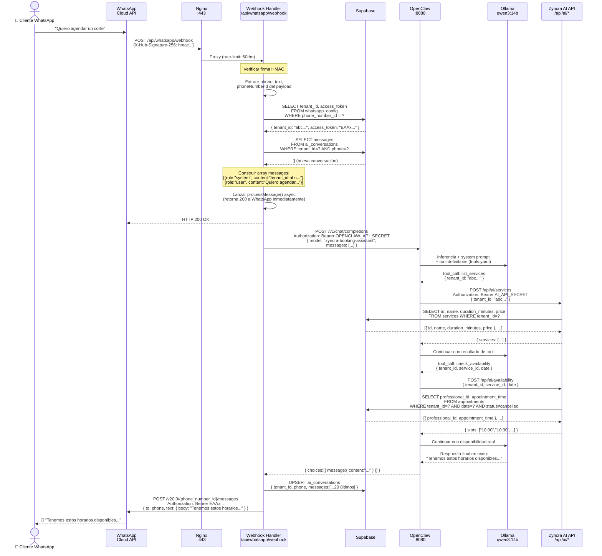
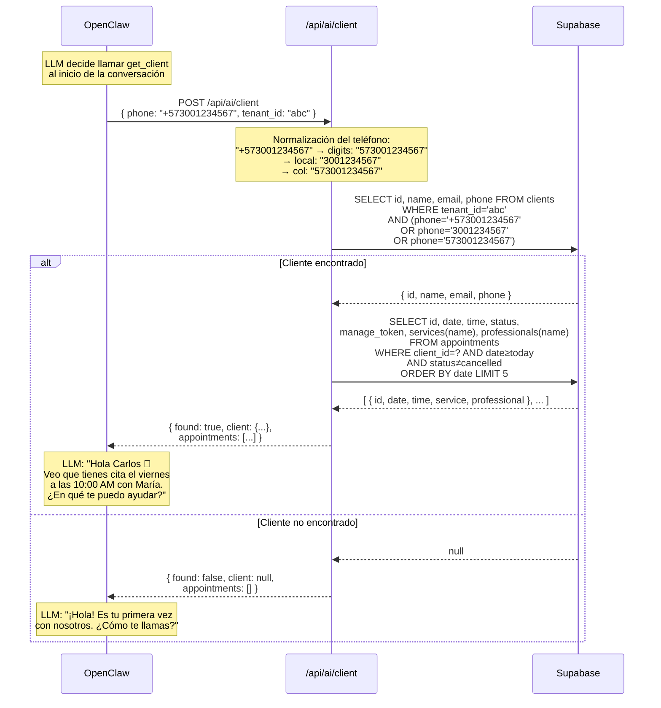
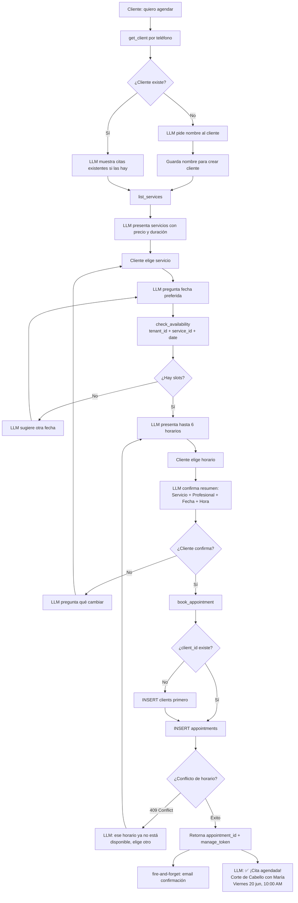
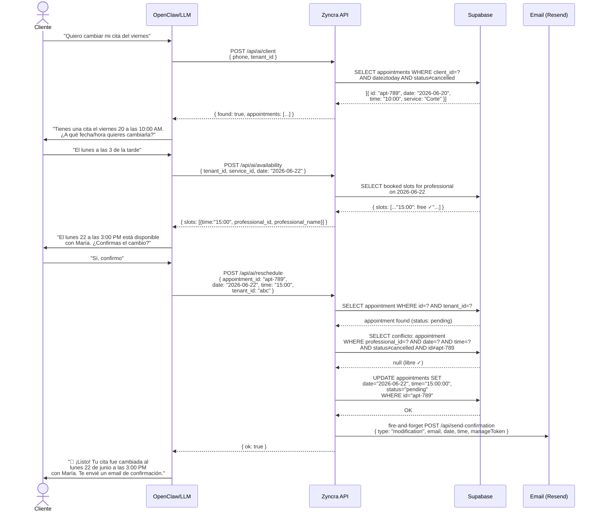
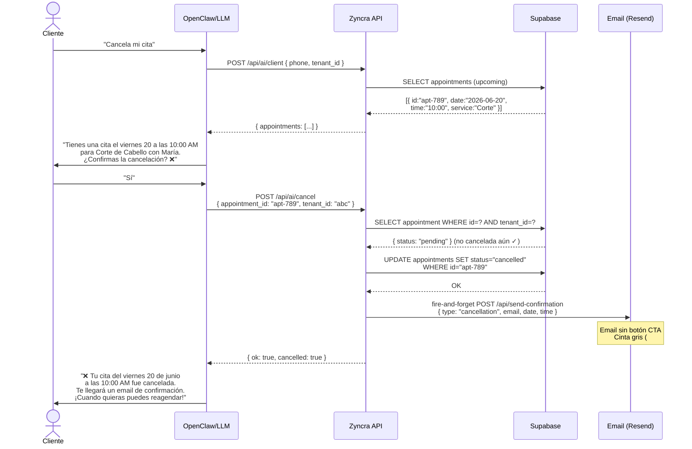

# Zyncra AI Booking Assistant — Diagramas de Flujo

---

## 1. Arquitectura general

```
┌──────────────────────────────────────────────────────────────────────────────┐
│                          ORACLE CLOUD FREE TIER (ARM)                        │
│                                                                              │
│   ┌─────────┐    ┌──────────────────────────────────────────────────────┐   │
│   │  Nginx  │    │  Docker Network: zyncra_ai_net                       │   │
│   │  :443   ├───►│                                                      │   │
│   └────┬────┘    │  ┌────────────┐   ┌───────────┐   ┌─────────────┐  │   │
│        │         │  │  Zyncra    │   │ OpenClaw  │   │   Ollama    │  │   │
│        │         │  │ (Next.js)  │◄──│  :8080    │──►│   :11434   │  │   │
│        └─────────┼─►│  :3000     │   │           │   │ qwen3:14b  │  │   │
│                  │  └─────┬──────┘   └─────┬─────┘   └─────────────┘  │   │
│                  │        │                │                            │   │
│                  └────────┼────────────────┼────────────────────────────┘   │
└───────────────────────────┼────────────────┼────────────────────────────────┘
                            │ service_role   │ AI_API_SECRET
                            ▼                ▼
                    ┌───────────────────────────────┐
                    │        SUPABASE               │
                    │  PostgreSQL + RLS             │
                    │  appointments / clients       │
                    │  ai_conversations             │
                    │  whatsapp_config              │
                    └───────────────────────────────┘

                    ┌───────────────────────────────┐
WHATSAPP USER ─────►│  WhatsApp Cloud API (Meta)    │
                    └───────────────┬───────────────┘
                                    │ webhook POST
                                    ▼
                            https://your-domain.com
                            /api/whatsapp/webhook
```

---

## 2. Cadena de autenticación

```
┌─────────────────────────────────────────────────────────────────┐
│                     CAPAS DE AUTENTICACIÓN                      │
└─────────────────────────────────────────────────────────────────┘

  WhatsApp Cloud API
        │
        │  HMAC-SHA256 (X-Hub-Signature-256)
        │  Firmado con: WHATSAPP_APP_SECRET
        ▼
  /api/whatsapp/webhook  [Next.js]
        │
        │  Bearer OPENCLAW_API_SECRET
        │  (en Authorization header)
        ▼
  OpenClaw  :8080
        │
        │  Bearer AI_API_SECRET
        │  (en cada tool call hacia Zyncra)
        ▼
  /api/ai/*  [Next.js]
        │
        │  SUPABASE_SERVICE_ROLE_KEY
        │  (bypassa RLS — tenant_id validado manualmente)
        ▼
  Supabase PostgreSQL

  ┌─────────────────────────────────────────────────────────────┐
  │  NOTA: Supabase service_role ignora RLS.                   │
  │  Por eso cada endpoint /api/ai/* valida tenant_id          │
  │  explícitamente antes de cualquier query:                  │
  │                                                            │
  │    .eq("tenant_id", tenant_id)   ← siempre presente       │
  └─────────────────────────────────────────────────────────────┘
```

---

## 3. Flujo completo de un mensaje entrante



---

## 4. Cómo OpenClaw descubre y ejecuta tools

```
┌─────────────────────────────────────────────────────────────────────────────┐
│                  CICLO DE TOOL CALLING EN OPENCLAW                          │
└─────────────────────────────────────────────────────────────────────────────┘

  STARTUP
  ───────
  OpenClaw lee tools.yaml en arranque
  → Construye JSON Schema de cada herramienta
  → Lo inyecta en cada llamada al LLM como "tools" parameter

  DESCUBRIMIENTO (compile-time)
  ──────────────────────────────
  tools.yaml                          JSON Schema → LLM
  ┌──────────────────────┐           ┌──────────────────────────────────────┐
  │ - name: check_avail  │  parse    │ {                                    │
  │   description: "..."  │ ──────► │   "type": "function",                │
  │   parameters:        │           │   "function": {                     │
  │     tenant_id: str   │           │     "name": "check_availability",   │
  │     service_id: str  │           │     "description": "...",           │
  │     date: str        │           │     "parameters": { ... }           │
  │   endpoint:          │           │   }                                  │
  │     url: ${ZYNCRA}   │           │ }                                    │
  │     method: POST     │           └──────────────────────────────────────┘
  └──────────────────────┘

  EJECUCIÓN (run-time — por cada tool call del LLM)
  ──────────────────────────────────────────────────

  Ollama devuelve:
  ┌──────────────────────────────────────────────────┐
  │ <tool_call>                                      │
  │ {                                                │
  │   "name": "check_availability",                  │
  │   "arguments": {                                 │
  │     "tenant_id": "abc-123",                      │
  │     "service_id": "svc-456",                     │
  │     "date": "2026-06-20"                         │
  │   }                                              │
  │ }                                                │
  │ </tool_call>                                     │
  └──────────────────────────────────────────────────┘
           │
           │  OpenClaw intercepta el token <tool_call>
           ▼
  Busca en tools.yaml:  name == "check_availability"
           │
           ▼
  Construye HTTP request:
  ┌──────────────────────────────────────────────────┐
  │ POST http://zyncra:3000/api/ai/availability      │
  │ Authorization: Bearer AI_API_SECRET              │
  │ Content-Type: application/json                   │
  │                                                  │
  │ {                                                │
  │   "tenant_id": "abc-123",    ← del LLM           │
  │   "service_id": "svc-456",   ← del LLM           │
  │   "date": "2026-06-20"       ← del LLM           │
  │ }                                                │
  └──────────────────────────────────────────────────┘
           │
           ▼
  Recibe respuesta: { slots: [...] }
           │
           ▼
  Inyecta en conversación:
  ┌──────────────────────────────────────────────────┐
  │ { role: "tool",                                  │
  │   name: "check_availability",                    │
  │   content: '{"slots":[{"time":"10:00",...}]}'    │
  │ }                                                │
  └──────────────────────────────────────────────────┘
           │
           ▼
  Segunda inferencia Ollama → respuesta final en texto
```

---

## 5. Flujo: Identificación del cliente por teléfono



---

## 6. Flujo completo: Creación de cita



---

## 7. Flujo completo: Reprogramación



---

## 8. Flujo completo: Cancelación



---

## 9. Tenant_id a través del sistema

```
┌──────────────────────────────────────────────────────────────────────────────┐
│                    PROPAGACIÓN DEL TENANT_ID                                 │
└──────────────────────────────────────────────────────────────────────────────┘

  1. IDENTIFICACIÓN (Webhook)
  ───────────────────────────
  WhatsApp payload contiene:
    value.metadata.phone_number_id = "109876543210"

  Webhook consulta:
    SELECT tenant_id, access_token
    FROM whatsapp_config
    WHERE phone_number_id = "109876543210"
    → tenant_id = "abc-123-def-456"

  2. INYECCIÓN EN CONTEXTO (Webhook → OpenClaw)
  ──────────────────────────────────────────────
  Si es nueva conversación, se crea system message:
  {
    role: "system",
    content: "...tenant_id: \"abc-123-def-456\".
              Cuando uses herramientas siempre incluye
              tenant_id: \"abc-123-def-456\"."
  }

  Este message queda persistido en ai_conversations
  y se incluye en CADA llamada a OpenClaw.

  3. EXTRACCIÓN POR EL LLM (OpenClaw → Zyncra)
  ──────────────────────────────────────────────
  El LLM lee el tenant_id del system message
  y lo incluye en cada tool call:

  check_availability({ tenant_id: "abc-123-def-456", ... })
  book_appointment({   tenant_id: "abc-123-def-456", ... })
  cancel_appointment({ tenant_id: "abc-123-def-456", ... })

  4. VALIDACIÓN EN API (Zyncra)
  ──────────────────────────────
  Cada endpoint /api/ai/* valida:

  .eq("service_id", service_id).eq("tenant_id", tenant_id)
                                 ↑
                    Cross-tenant access imposible:
                    aunque el LLM enviara tenant_id incorrecto,
                    la query no devolvería datos de otro negocio.

  5. AISLAMIENTO EN SUPABASE
  ────────────────────────────
  Aunque se usa service_role (bypassa RLS),
  el WHERE tenant_id = ? garantiza que:

  ┌─────────────────────────────────────────────────────┐
  │  Negocio A (tenant aaa)  │  Negocio B (tenant bbb)  │
  │  ─────────────────────── │  ───────────────────────  │
  │  Solo ve sus citas       │  Solo ve sus citas        │
  │  Solo ve sus clientes    │  Solo ve sus clientes     │
  │  Solo sus servicios      │  Solo sus servicios       │
  └─────────────────────────────────────────────────────┘
```

---

## 10. Resumen de endpoints y seguridad

```
┌──────────────────────────────────────────────────────────────────────────────┐
│  ENDPOINT                     │ AUTH              │ TENANT VALIDATION        │
├───────────────────────────────┼───────────────────┼──────────────────────────┤
│  GET /api/whatsapp/webhook    │ hub.verify_token  │ —                        │
│  POST /api/whatsapp/webhook   │ HMAC signature    │ vía whatsapp_config table│
├───────────────────────────────┼───────────────────┼──────────────────────────┤
│  POST /api/ai/availability    │ AI_API_SECRET     │ .eq("tenant_id", ?)      │
│  POST /api/ai/services        │ AI_API_SECRET     │ .eq("tenant_id", ?)      │
│  POST /api/ai/professionals   │ AI_API_SECRET     │ .eq("tenant_id", ?)      │
│  POST /api/ai/client          │ AI_API_SECRET     │ .eq("tenant_id", ?)      │
│  POST /api/ai/book            │ AI_API_SECRET     │ .eq("tenant_id", ?) x2   │
│  POST /api/ai/reschedule      │ AI_API_SECRET     │ .eq("tenant_id", ?)      │
│  POST /api/ai/cancel          │ AI_API_SECRET     │ .eq("tenant_id", ?)      │
├───────────────────────────────┼───────────────────┼──────────────────────────┤
│  POST /api/send-confirmation  │ internal only     │ ninguno (email only)     │
│  GET/POST /api/manage/[token] │ manage_token UUID │ vía manage_token         │
│  GET /api/cron/reminders      │ CRON_SECRET       │ itera todos los tenants  │
└──────────────────────────────────────────────────────────────────────────────┘
```
